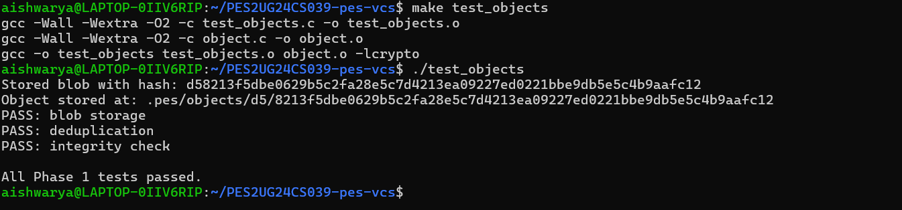
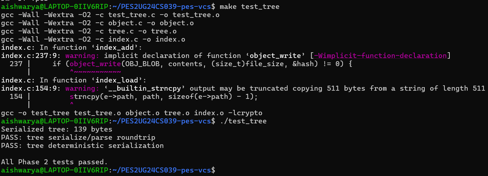
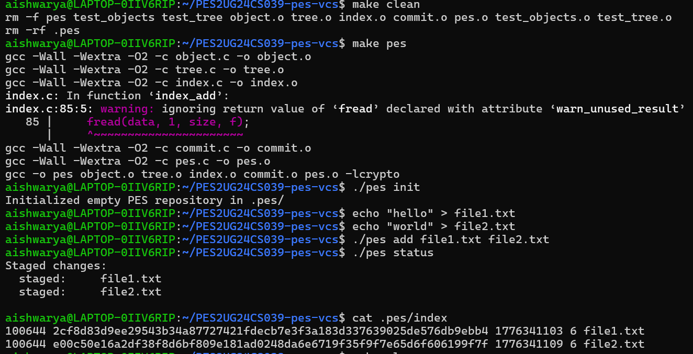
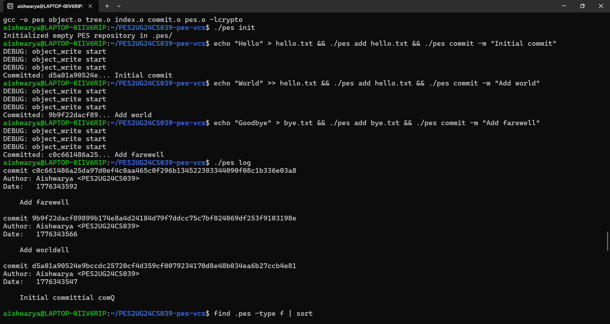
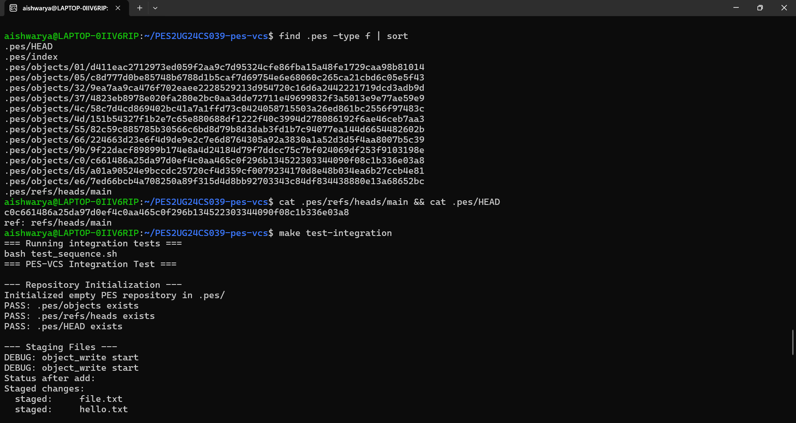
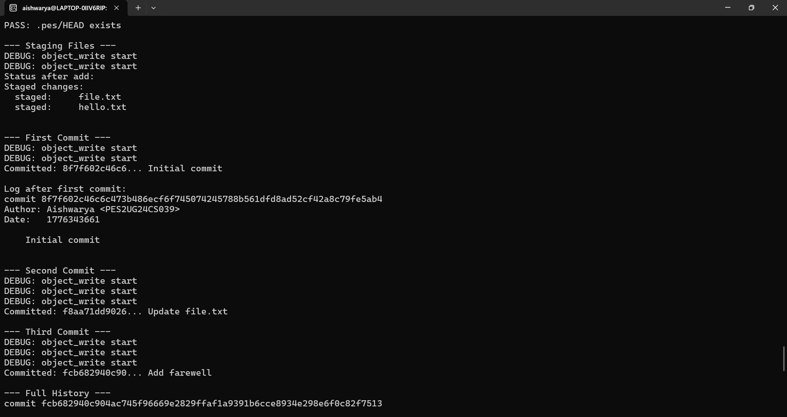
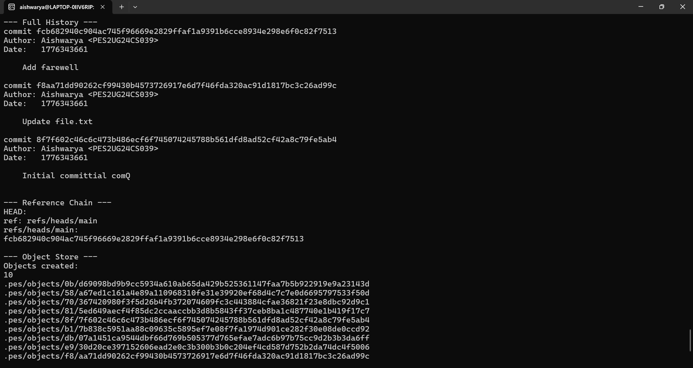
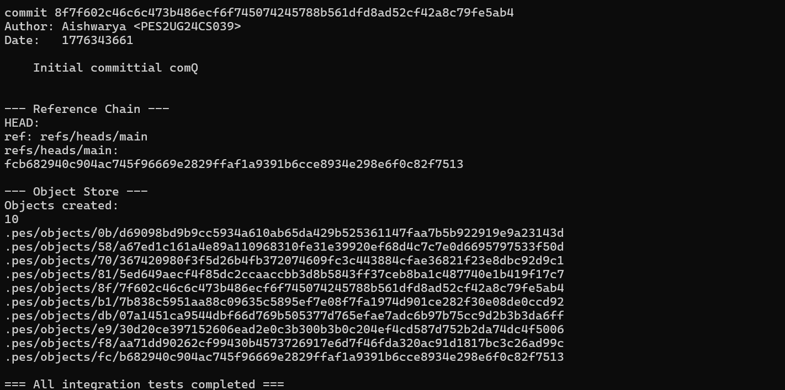

# PES Version Control System

## 📌 Overview
This project implements a mini Git-like Version Control System in C.  
It supports object storage, staging, commits, and log history.

---

## 🚀 Features
- Blob storage
- Tree structure
- Index (staging area)
- Commit system
- Log history

---

## 🛠️ How to Run

make pes  
./pes init  
./pes add <file>  
./pes commit -m "message"  
./pes log  

---

## 📸 Screenshots

### objects.png

### tree.png

### index.png

### commit_file1.png

### commit_file2.png

### commit_file3.png

### commit_file4.png

### commit_file5.png

---

## 📂 Project Structure

.
├── object.c  
├── tree.c  
├── index.c  
├── commit.c  
├── pes.c  
├── Makefile  
├── screenshots/  

---

## 🧠 Concepts Used
- File handling in C  
- SHA-256 hashing  
- Version control system basics  

---

## ✅ Conclusion
This project demonstrates the working of a Git-like version control system with staging, committing, and history tracking.

---